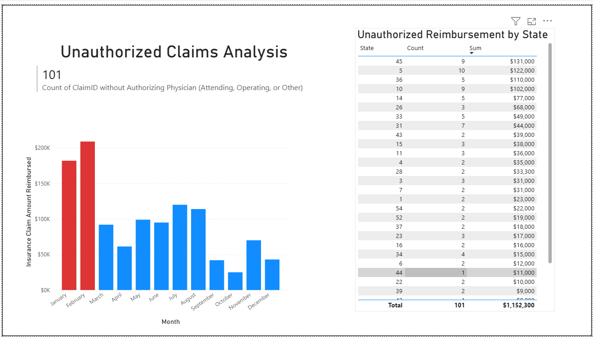

# Healthcare Revenue Integrity Audit: Unauthorized Claims Analysis

## Project Overview
This project involved a comprehensive financial and data integrity audit of an enterprise healthcare dataset containing over **40,000 records**. The primary objective was to identify "Ghost Claims"—reimbursed inpatient claims that lacked required physician attribution—and to quantify the resulting financial risk to the organization. 

## Key Findings
* **Total Revenue at Risk:** Identified **$1,152,300** in unauthorized reimbursements across **101 claims** that completely lacked physician data.
* **Geographic Hotspots:** Discovered that data corruption and financial exposure spanned **32 states**, with **State 45** representing the highest risk ($131,000 in unauthorized claims).
* **Temporal Surge:** Analysis revealed a significant surge in unauthorized activity during **January and February**, indicating a potential seasonal failure in reporting protocols or data entry.

## Dashboard Preview

## Technical Implementation

### 1. SQL (Data Isolation & Aggregation)
Utilized SQL queries to isolate corrupted records and perform geographic correlations.
* **Detection:** Filtered for claims where the `AttendingPhysician`, `OperatingPhysician`, and `OtherPhysician` fields were all NULL while a reimbursement amount was present.
* **Financial Impact:** Aggregated loss totals and calculated average claim values for executive-level reporting.
* **Regional Audit:** Performed SQL JOINs between claim data and beneficiary tables to rank state-level risk.

### 2. Power BI (Business Intelligence)
Developed an interactive dashboard to visualize the audit findings for stakeholders.
* **Surge Analysis:** Bar charts tracking unauthorized reimbursements by month.
* **Risk Heatmap:** Tabular ranking of financial loss by State and Claim Count.
* **Key Performance Indicators (KPIs):** Instant visibility into total claim counts and total financial exposure.

## How to Navigate This Repository
* **`Healthcare_Audit.sql`**: Contains the full detection, summary, and geographic correlation queries used in the audit.
* **`Healthcare_Audit_Results.xlsx`**: The refined dataset generated via SQL, serving as the data source for the Power BI dashboard.
* **`Unauthorized_Claims_Analysis_Dashboard.pbix`**: The source Power BI file for interactive exploration.
* **`Unauthorized_Claims_Analysis_Dashboard.png`**: High-resolution screenshot of the final audit report.
